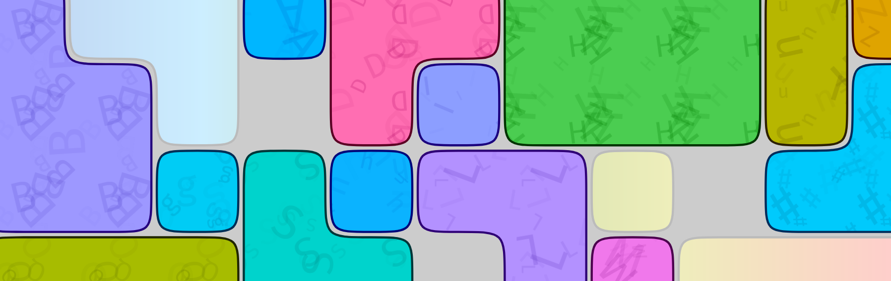

A web-app for playing, and rust-crate for solving, sliding-block puzzles like the [ones from the Professor Layton games](https://layton.fandom.com/wiki/Category:Sliding).

# Web-App
[Try it out!](https://lumi-a.github.io/sliding-blocks) Written in TypeScript 🚬, the code is in the `www`-directory. You can also specify your own puzzles to play around with and have them be solved automatically using the shortest possible number of moves! This uses the rust-crate compiled to web-assembly.

<!-- TODO: "Document" puzzle-syntax -->

# Solver
Written in rust 🦀, the code is in the top-level directory. To accomodate all the speedup-ideas I could think of, the code became quite complicated. If you'd like to understand what's going on, feel free to contact me, and I'll gladly explain it! At a very basic level:
- We imagines a graph, where the nodes are all the different legal block-configurations, and two nodes are adjacent if one block-configuration can be transformed into the other block-configuration by moving a single block.
- Call a block a "goal-block" if it appears in the goal-configuration, i.e. it has a goal-position it has to reach for the puzzle to be considered "solved".
- If there is only one goal-block, we essentially run BFS.

## Tighter ASTAR-heuristics
If you have any better ideas for ASTAR-heuristics (whether in the single-goal-block or multiple-goal-block case), please share them! Two ideas I had:
1. For every goal-block B, count how many other blocks it has to cross in order to reach its goal.
2. A relaxation of the first idea: For every goal-block B, imagine a new graph, where the nodes are the positions of B such that B is still in-bounds (but might intersect other blocks), and edges are movements of B by a single unit. Put costs on these nodes: If B is in a specific position, the cost of that node is:\
  \[For all other blocks B' that intersect B in that position, sum C(B')\],\
  where C(B') is a constant (that depends on the shape of B') such that the resulting heuristic is admissible. If you assume both B and B' to be connected (as subgraphs of ℤ²), I think you can choose C(B') as the diameter of B⨭B' (as a subgraph of ℤ²), where B⨭B' is the union of all (B+x) with (B+x)∩B'≠∅ and x∈ℤ². I'm sorry for writing this so horribly, and haven't proven this as admissible.\
  With these costs, find the shortest weighted path from the current offset of B to its goal-position, e.g. using Dijkstra. After doing this for all goal-blocks B, take the minimum over all the values.

Both of these ideas are implemented in the `astar`-branch, but not used, because these heuristics turned out to be too slow to be practical. I'm also way less certain that they work correctly.

# Build-Instructions
## Web-App
Requires [npm](https://www.npmjs.com/). Go into the `www` directory, run:
- `npm install` for the initial setup,
- `npm run start` to serve the site locally
- `npm run build` to build the website with webpack into the `www/dist` directory.
- `npm run deploy` to deploy the website to github-pages. This automatically runs `npm run build` first.

## Solver
Requires [Rust](https://www.rust-lang.org/) and cargo. In the top-level directory, run:
- `cargo bench` to run benchmarks.
- `cargo test` to run tests.
- Compiling to wasm: First install [`wasm-pack`](https://rustwasm.github.io/wasm-pack/installer/), then run `wasm-pack build` in the top-level directory. This outputs into the `pkg`-directory, where the web-app then reads it from.